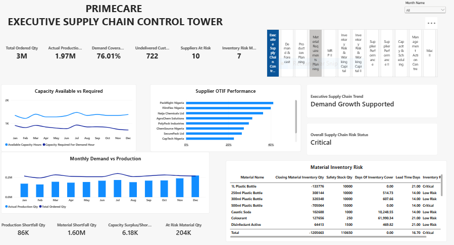
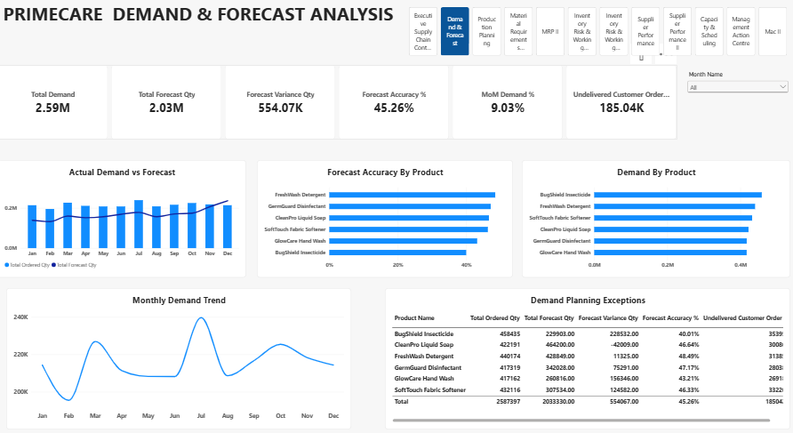
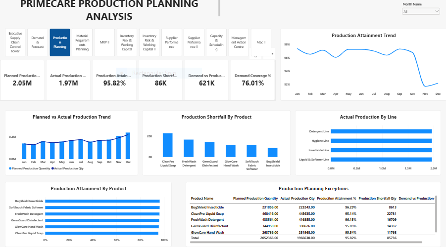
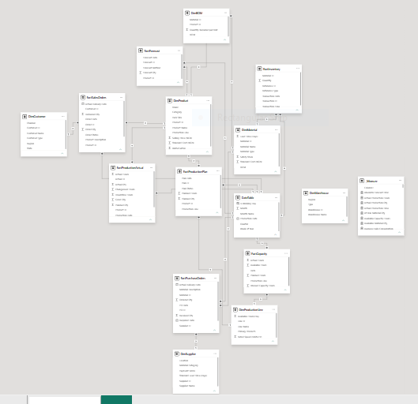

# Primecare-FMCG-Integrated-Demand-Production-Supply-Chain-Control-Tower
## Designed and developed an end-to-end Power BI decision-support system integrating FMCG demand, forecasting, production planning, material requirements, inventory, procurement, supplier performance, capacity and customer fulfilment data to provide management with integrated KPI monitoring and exception-based decision support. 

## Executive Summary
- The PrimeCare FMCG Integrated Demand, Production & Supply Chain Control Tower is an end-to-end Power BI decision-support solution developed to provide management with a consolidated view of the company's manufacturing and supply-chain operations.
- The project addresses a common FMCG challenge: operational data is generated across multiple functions, including sales, demand planning, production, procurement, inventory, suppliers and customer fulfilment, making it difficult for management to see how decisions in one area affect performance in another.
- The solution integrates these business functions into a single analytical environment, enabling management to monitor performance, identify operational risks and investigate exceptions across the supply chain.
## The Business Problem
PrimeCare FMCG Ltd. operates across demand planning, production, procurement, inventory, suppliers and customer order fulfilment.
Management was facing a common FMCG challenge: data existed across different operational areas, but there was no single analytical view showing how these areas were connected.
### Key Questions Addressed:
- Is customer demand being adequately supported by production?
- How accurate is the demand forecast?
- Are production plans aligned with actual demand?
- Which materials could create production shortages?
- Which suppliers are affecting material availability?
- Is inventory sufficient, excessive or at risk?
- Does available production capacity support demand?
- Which customer orders remain undelivered?
- Where are the major supply-chain exceptions requiring management attention?
## The Process (Methodology)
### Tools Used:
Power BI, Power Query, DAX
### Data Sourcing & Overview
The dataset consists of approximately 10,000  transactions with 12 columns, covering operations across different departments of the business.
### Data Cleaning & Transformation (ETL)
Before building the dashboard, the transactional data went through a data-quality and transformation process. 
Key activities included: 
- Standardising product descriptions
- Handling missing delivery dates
- Identifying duplicate transaction records
- Standardising order-status values
- Separating delivered and undelivered customer orders
- Validating production-plan and actual-production data
- Checking purchase-order quantities against received quantities
- Validating inventory transactions
- Establishing working-day logic
- Cross-checking relationships between master and transactional data
- Removed duplicate entries from the dataset.
- Created a date table
  

## Analysis & Insights
This section breaks down the data into actionable stories.
### Insight 1 — Capacity was not the immediate factory-level constraint
The capacity analysis showed zero capacity shortfall across the monthly periods analysed.
For example, in the monthly capacity analysis, required capacity remained below available capacity throughout the year.
This means the management focus should not automatically be:
"We need more production capacity."
Instead, the analysis suggests that available capacity needs to be evaluated alongside demand, production execution, material availability and scheduling efficiency.
#### Business implication:
Before investing in additional production capacity, management should investigate whether existing capacity is being fully converted into productive output.

### Insight 2 — Demand and production must be analysed together
The project introduced:
- Demand vs Production Gap and Demand Coverage %
This is important because high production output does not necessarily mean that customer demand is adequately supported.
For example:
Production may increase, but if demand is increasing faster, the business can still experience fulfilment pressure.
#### Business implication:
Production planning should be continuously aligned with demand signals rather than relying solely on historical production targets.
### Insight 3 — Supplier performance has a direct operational connection
Supplier analysis incorporates:
OTIF + Fill Rate + Delay + Outstanding PO
This means a supplier issue is not viewed as an isolated procurement KPI.
A late or partial delivery can eventually affect:
Material Availability → Production → Inventory → Customer Fulfilment
#### Business implication:
Supplier performance reviews should prioritise materials that have a direct impact on production continuity.

### Business Recommendations 
#### Strengthen Demand-Driven Production Planning
Production plans should be reviewed against current demand and forecast signals rather than relying only on fixed production targets.
##### Recommended approach:
Demand → Forecast → Production Plan → Capacity → Materials

### Introduce Material Risk Reviews Before Production Scheduling
Before committing production schedules, planners should check whether critical materials are:
- Available
- Above safety stock
- Within lead-time coverage
- Supported by outstanding purchase orders
This can reduce the risk of production interruptions caused by material shortages.
### Prioritise Critical Suppliers
Supplier monitoring should focus particularly on suppliers whose materials can stop production.
A supplier with poor OTIF supplying a non-critical material may require less immediate attention than a supplier supplying a production-critical material.

[Interactive Power BI Link](https://app.powerbi.com/view?r=eyJrIjoiM2MxM2NlNWEtM2I0MC00ZjNmLWI4OTctM2FiZWY5NWZiMTRjIiwidCI6IjY0M2NkODIwLWU2YzYtNGI2ZC05ZDc5LTJjOTgwOTllMTg3MCJ9)

